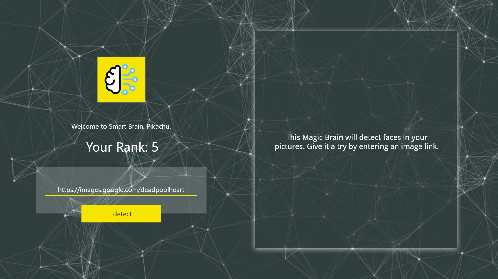
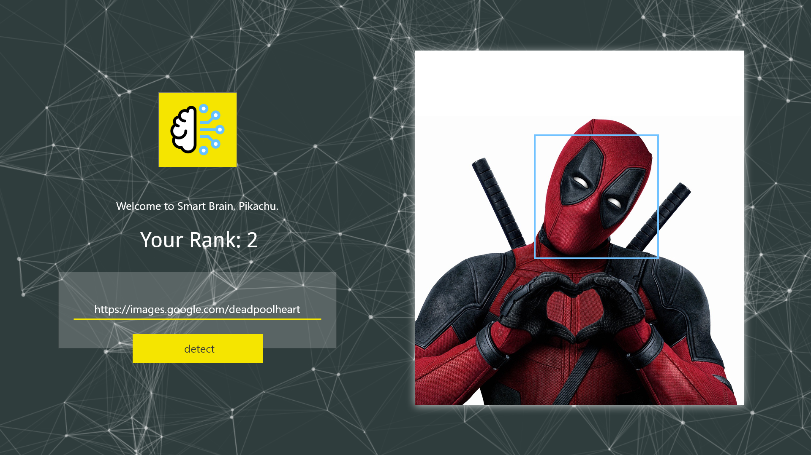

This project is the final full-stack project for The Complete Web Developer course on Udemy.

The of intent this project:
1. Use facial recognition API to detect face in an image
2. Allow users to insert their own image link
3. Users can sign in and sign out
4. Users can track their progress and see their ranking

### Default Website View

### Website View with Image
